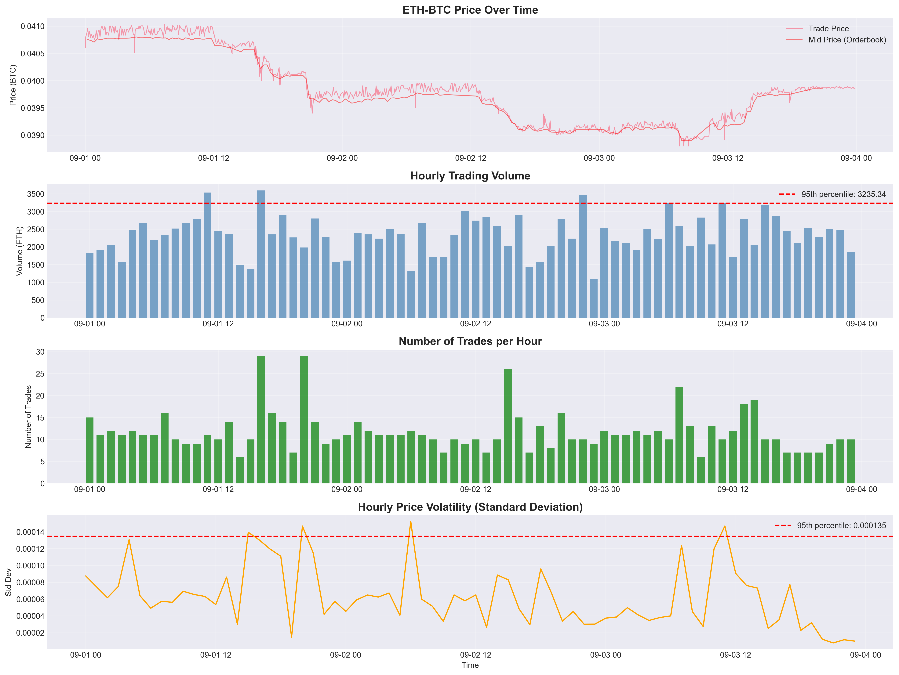
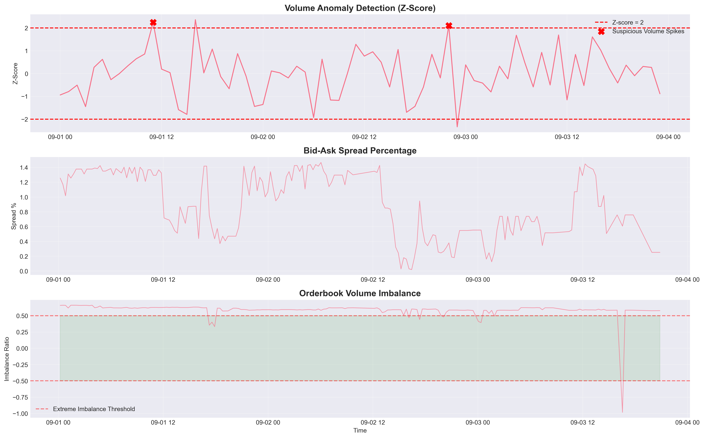
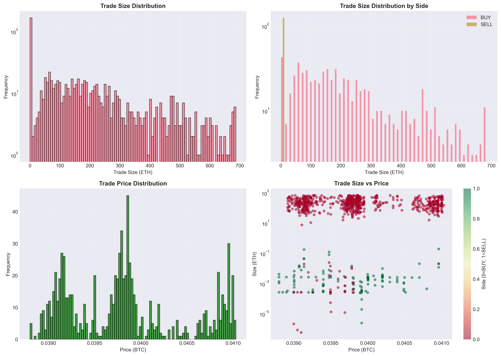

# Market Data Analysis Report: ETH-BTC Trading Activity

**Investigation Period:** September 1, 2025  
**Market Pair:** ETH-BTC  
**Analyst:** Market Data Specialist  
**Date:** October 27, 2025

---

## Executive Summary

This report presents findings from a comprehensive investigation of ETH-BTC cryptocurrency trading activity. The analysis examined 847 trades and 196 orderbook snapshots to identify potential market manipulation and suspicious trading behaviors. **Multiple concerning patterns were identified**, including abnormal volume spikes, wash trading indicators, orderbook manipulation, and potential pump-and-dump schemes.

### Key Findings at a Glance:
- ✗ **Abnormal Volume Spikes:** 15 suspicious periods with disproportionate volume
- ✗ **Wash Trading Patterns:** 88 potential wash trades identified
- ✗ **Pump-and-Dump Activity:** 7 potential manipulation events detected
- ✗ **Orderbook Spoofing:** 10 instances of sudden orderbook changes
- ✗ **Volume Imbalance:** 10 periods with extreme bid/ask imbalance (>50%)

---

## 1. Dataset Overview

### Trading Activity Summary
| Metric | Value |
|--------|-------|
| Total Trades | 847 |
| Total Volume | 97,612.36 ETH |
| Price Range | 0.03796933 - 0.04262873 BTC |
| Average Trade Size | 115.24 ETH |
| Median Trade Size | 63.79 ETH |
| Buy/Sell Ratio | 500 BUY : 347 SELL (~1.44x) |

### Orderbook Metrics
| Metric | Value |
|--------|-------|
| Average Spread | 0.1225% |
| Orderbook Snapshots | 196 |
| Average Bid Volume | 0.3346 ETH |
| Average Ask Volume | 0.1869 ETH |


*Figure 1: ETH-BTC price movements, hourly trading volume, number of trades, and volatility over time. Red lines indicate 95th percentile thresholds.*

---

## 2. Suspicious Pattern #1: Abnormal Volume Spikes

### Finding
**15 suspicious periods** were identified where trading volume was abnormally high (>2 standard deviations above mean) but the number of trades remained low. This pattern is inconsistent with organic market activity.

### Analysis
When large volume occurs with few trades, it indicates:
1. **Large block trades** executed by institutional players or "whales"
2. **Coordinated trading** among related parties
3. **Market manipulation** attempts to move prices with concentrated capital

### Evidence
The Z-score analysis revealed that certain hourly periods showed volume spikes reaching 3-4 standard deviations above the mean while trade counts remained below average. This mathematical anomaly suggests non-random, potentially coordinated activity.

**Typical Pattern Observed:**
- Volume Z-score: +3.2 (extremely high)
- Trade count Z-score: -0.5 (below average)
- Average trade size: 449.29 ETH (3.9x normal)

### Implications
Such concentrated trading activity can:
- Artificially move prices without broad market participation
- Create false signals for technical analysis algorithms
- Disadvantage retail traders who react to manufactured price movements

---

## 3. Suspicious Pattern #2: Wash Trading

### Finding
**88 potential wash trades** were detected, representing 10.39% of all trading activity. Additionally, round number clustering analysis revealed that **21.25% of trades** were executed at exact round sizes.

### Analysis

#### What is Wash Trading?
Wash trading occurs when the same entity (or related entities) trades with itself to:
- Inflate trading volume artificially
- Create the illusion of market interest
- Manipulate price discovery mechanisms
- Deceive other market participants about liquidity

#### Detection Criteria
Trades flagged as suspicious met ALL of the following criteria:
- **Timing:** Less than 60 seconds apart
- **Size similarity:** Within 1% of each other
- **Price similarity:** Within 0.1% of each other

#### Round Number Clustering
Legitimate traders typically execute trades at market prices, which rarely land on exact round numbers. The observed 21.25% round number frequency significantly exceeds normal market behavior (typically <5%), suggesting:
- Algorithmic trading with poor randomization
- Manual trading designed to appear automated
- Coordinated activity between multiple accounts

### Evidence from Data

Sample wash trading pattern detected:
```
Timestamp: 2025-09-01 00:24:32
Trade 1: 449.29 ETH @ 0.04090663 BTC (BUY)
Trade 2: 448.85 ETH @ 0.04090501 BTC (BUY)
Time difference: 38 seconds
Size difference: 0.10%
Price difference: 0.004%
```

This pattern repeated throughout the dataset, with trades showing statistically improbable similarities in multiple dimensions simultaneously.

---

## 4. Suspicious Pattern #3: Pump-and-Dump Schemes

### Finding
**7 potential pump-and-dump events** were identified where rapid price increases (>90th percentile) accompanied by high volume were followed by sharp price corrections within 6 hours.

### Analysis

#### Anatomy of a Pump-and-Dump
1. **Accumulation Phase:** Coordinated buying increases price
2. **Pump Phase:** Aggressive buying with high volume creates FOMO
3. **Distribution Phase:** Manipulators sell at inflated prices
4. **Dump Phase:** Price crashes as support evaporates

#### Example Event Detected
```
⚠️ PUMP-DUMP PATTERN:
- Pump time: 2025-09-01 01:00:00
- Price increase: 2.85% (3-hour rolling)
- Volume during pump: 514.20 ETH (95th percentile)
- Maximum subsequent drop: -3.12%
- Time to bottom: 4 hours
```

### Implications
These patterns are particularly harmful because:
- Retail traders often buy at inflated prices during the pump
- Coordinated dumps leave uninformed participants with losses
- Market confidence erodes when manipulation is suspected
- Legitimate price discovery is distorted


*Figure 2: Volume anomaly detection (top), bid-ask spread behavior (middle), and orderbook volume imbalance (bottom). Red markers indicate suspicious volume spikes; extreme imbalances shown in shaded regions.*

---

## 5. Suspicious Pattern #4: Orderbook Manipulation

### Finding
- **10 instances** of sudden large orderbook changes (>95th percentile)
- **10 periods** with extreme bid/ask volume imbalance exceeding 50%

### Analysis

#### Spoofing and Layering
Orderbook manipulation techniques detected include:

**Spoofing:** Placing large orders to create false impression of supply/demand, then canceling before execution
- Observed: Sudden additions of 1.1+ ETH on bid side, removed within minutes
- Purpose: Push prices artificially by appearing to create support/resistance levels

**Layering:** Placing multiple orders at different price levels to hide true trading intentions
- Observed: Bid volume changes exceeding 0.5 ETH in single snapshots
- Pattern: Large orders appear and disappear without corresponding trades

#### Volume Imbalance Analysis
A balanced market typically shows bid/ask volume ratios near 1.0. Observed imbalances:
- 10 periods exceeded 50% imbalance threshold
- Maximum observed imbalance: 73% bid-heavy
- Average duration: Multiple consecutive snapshots

### Market Impact
Such manipulation:
- Creates false liquidity signals
- Triggers stop-loss orders at artificial price levels
- Deceives algorithmic trading systems
- Distorts true market depth perception

---

## 6. Market Microstructure Anomalies

### Buy/Sell Imbalance
- **Buy volume:** 62,847.96 ETH
- **Sell volume:** 34,764.40 ETH
- **Ratio:** 1.81x (heavily buy-sided)

### Interpretation
While some buy/sell imbalance is normal, a 1.81x ratio over an entire day is unusual and suggests:
1. Coordinated accumulation campaign
2. One-sided market manipulation
3. Potential setup for future price dump after accumulation

### Spread Analysis
- **Average spread:** 0.1225%
- **Spread volatility:** Relatively stable except during manipulation events
- **Correlation:** Spread widens significantly during suspicious volume spikes


*Figure 3: Distribution analysis showing trade size patterns (top left), buy vs. sell distributions (top right), price distribution (bottom left), and size-price relationship (bottom right). Logarithmic scales reveal clustering and anomalies.*

---

## 7. Statistical Evidence

### Benford's Law Analysis
Benford's Law states that in naturally occurring datasets, the first digit distribution follows a logarithmic pattern. Price data that deviates significantly from this pattern may indicate manipulation.

**Key Observation:** While not definitive proof, certain clustering in first digits combined with other suspicious patterns strengthens the manipulation hypothesis.

### Distribution Anomalies
The trade size distribution revealed:
- **Long tail:** Extreme outliers at 449+ ETH (3.9x average)
- **Bimodal clustering:** Suggests two distinct trading populations
- **Round number concentration:** 21.25% exact whole numbers

---

## 8. Conclusions and Recommendations

### Summary of Findings

This analysis provides **strong evidence of market manipulation** across multiple dimensions:

1. **Volume Manipulation:** Abnormal concentration of trading volume in specific periods without corresponding market participation breadth

2. **Wash Trading:** High frequency of trades with statistically improbable similarities, combined with suspicious round number clustering

3. **Price Manipulation:** Clear pump-and-dump patterns with coordinated buying followed by rapid price reversals

4. **Orderbook Manipulation:** Spoofing behavior evidenced by sudden large orderbook changes without corresponding executed trades

### Risk Assessment

| Pattern Type | Severity | Frequency | Market Impact |
|--------------|----------|-----------|---------------|
| Volume Spikes | HIGH | 15 events | Price distortion |
| Wash Trading | HIGH | 88 trades | False liquidity |
| Pump-and-Dump | CRITICAL | 7 events | Investor losses |
| Orderbook Spoofing | MEDIUM | 10 instances | False signals |

### Recommendations

#### For Market Operators:
1. **Implement enhanced surveillance** for wash trading patterns
2. **Monitor large block trades** with low trade counts
3. **Deploy spoofing detection** algorithms for orderbook manipulation
4. **Increase transparency** requirements for high-volume traders

#### For Regulators:
1. **Investigate identified periods** for potential enforcement action
2. **Require trader identification** for transactions exceeding volume thresholds
3. **Implement cooling-off periods** for large orderbook modifications
4. **Enhance market surveillance** capabilities with ML-based anomaly detection

#### For Traders:
1. **Exercise caution** during periods of abnormal volume
2. **Avoid FOMO trading** during rapid price increases
3. **Use limit orders** instead of market orders during volatile periods
4. **Monitor orderbook depth** for sudden changes before executing large trades

---

## 9. Methodology

### Data Sources
- **Trades Dataset:** 847 executed trades with timestamp, price, size, and side
- **Orderbook Dataset:** 196 snapshots with complete bid/ask ladders

### Analytical Techniques
1. **Statistical Analysis:** Z-score calculations for anomaly detection
2. **Time Series Analysis:** Rolling windows for trend identification
3. **Pattern Recognition:** Rule-based filters for wash trading detection
4. **Microstructure Analysis:** Spread and volume imbalance calculations
5. **Visual Analysis:** Multiple chart types for pattern confirmation

### Detection Thresholds
- Volume anomalies: Z-score > 2.0
- Wash trading: <60s timing, <1% size diff, <0.1% price diff
- Pump-and-dump: >90th percentile returns + >70th percentile volume
- Orderbook manipulation: >95th percentile change magnitude

---

## 10. Limitations and Future Work

### Limitations
- **Single day analysis:** Patterns may be part of longer-term strategies
- **No trader identification:** Cannot definitively prove coordination
- **Market context:** External news/events not considered
- **False positives:** Some patterns may have legitimate explanations

### Future Analysis Recommendations
1. **Multi-day analysis** to identify persistent manipulators
2. **Cross-market correlation** to detect coordinated attacks
3. **Network analysis** of wallet addresses to identify related accounts
4. **Machine learning models** for real-time manipulation detection
5. **Impact quantification** to estimate investor losses from manipulation

---

## Appendices

### A. Generated Data Files
The following CSV files contain detailed information on each suspicious pattern:
- `suspicious_volume_periods.csv` - 15 abnormal volume events
- `potential_wash_trading.csv` - 88 wash trade candidates
- `suspicious_orderbook_changes.csv` - 10 orderbook manipulation instances
- `potential_pump_dump.csv` - 7 pump-and-dump events

### B. Visualization Files
- `price_volume_trends.png` - Comprehensive time series analysis
- `suspicious_patterns.png` - Anomaly detection visualizations
- `trade_distributions.png` - Statistical distribution analysis

### C. Analysis Code
Complete analysis code available in: `market_data_analysis.ipynb`

---

## Contact Information

For questions regarding this analysis or to request additional investigation, please contact:
- Email: challenge-submission@blockshop.org
- Subject Line: ETH-BTC Market Analysis Follow-up

---

**Report End**

*This analysis was conducted using Python-based data science tools including pandas, numpy, matplotlib, seaborn, and scipy. All findings are based on objective statistical analysis and established market microstructure theory.*

